<h1 align="center">
  ⚙️ Service — Real-Time MERN Marketplace ⚡
</h1>

  

  
  
  
  

---

## 🚀 Overview

**Service** is a real-time **MERN web application** connecting **clients**, **workers**, and **admins** in one interactive system.

Clients can:
- 🧾 Select a **service category** (e.g., *Climatisation*, *Plumbing*, etc.)
- 📍 Enter location, order details, and preferred price range
- ⚡ Instantly send the order to nearby workers (e.g., within **8 km** radius)

Workers can:
- 👷‍♂️ Receive live job offers based on their category and distance  
- 💰 Place **bids** in real time within the client’s range  
- 🏆 Automatically win the job if they offer the **lowest bid**

Admins can:
- 🧭 Manage all users, services, and categories  
- 📊 Filter orders by status or category  
- 🧹 Add / delete users and view performance stats  

Each user has:
- 💬 **Real-time chat** system  
- 📈 **Dashboard** with all active and past orders  
- ⭐ Workers gain **+1 score** for each completed job (Acquired → Started → Completed)

---

## 🧩 Features

| Category | Description |
|-----------|-------------|
| 👤 **Authentication** | JWT-based login / register with role-based access |
| ⚙️ **Real-Time Orders** | Instant broadcast of new orders to nearby workers |
| 💬 **Live Chat** | Socket.IO chat across all roles |
| 🛠️ **Admin Panel** | Manage users, categories, and services |
| 📱 **Dashboards** | Custom dashboards for clients, workers, and admins |
| 💰 **Bidding System** | Real-time competitive bids |
| 📍 **Geo-Filtering** | Match workers by category & distance |
| ⭐ **Worker Scoring** | Reputation grows with completed jobs |

---

## 🖼️ Screenshots

### 🔐 Login / Register  

---

### 💼 Client Side — Pass Orders in Real Time  
| Create Order | Real-Time Dispatch |
|---------------|-------------------|
| 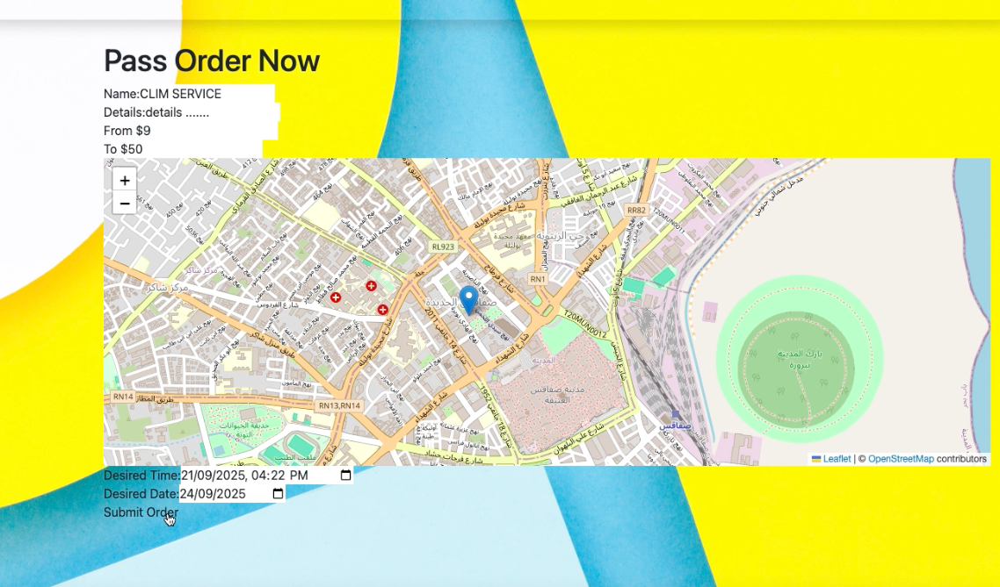 | 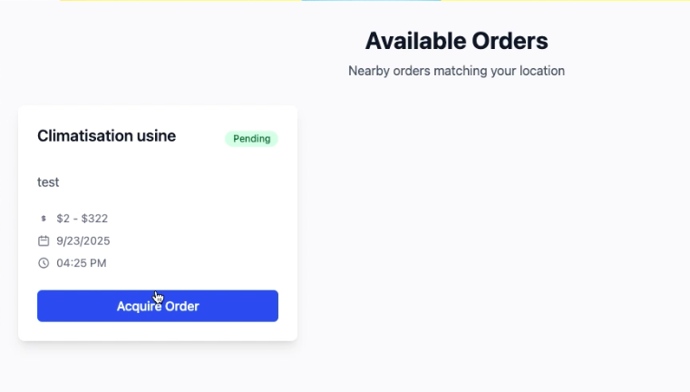 |

---

### 👷 Worker Side — Receive, Bid & Complete  
| Real-Time Orders | Place Bid | Order Acquired | Completed |
|------------------|-----------|----------------|------------|
| 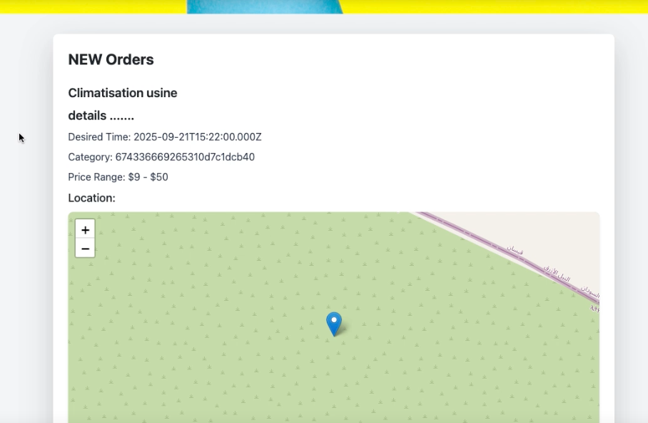 | 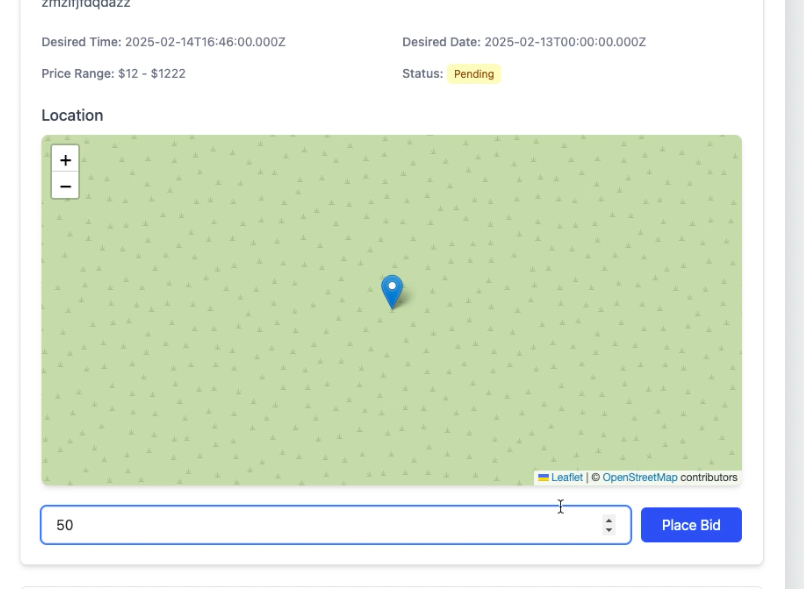 | 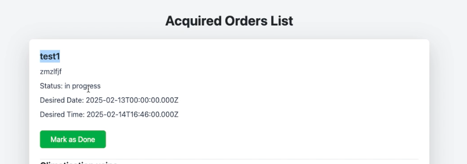 | 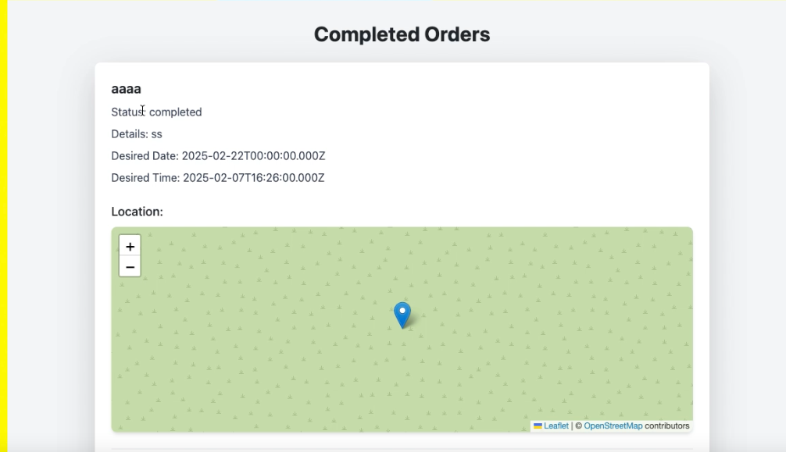 |

---

### 💰 Bidding Showcase  
| Bid 1 | Bid 2 |
|--------|--------|
|  | 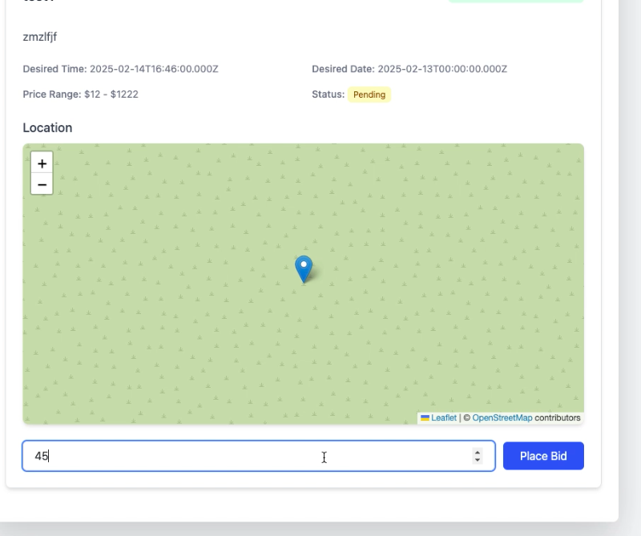 |

---

### 🧭 Admin Dashboard  
| Users | Filter by Role | Add/Delete Category | Filter Orders |
|--------|----------------|--------------------|----------------|
| 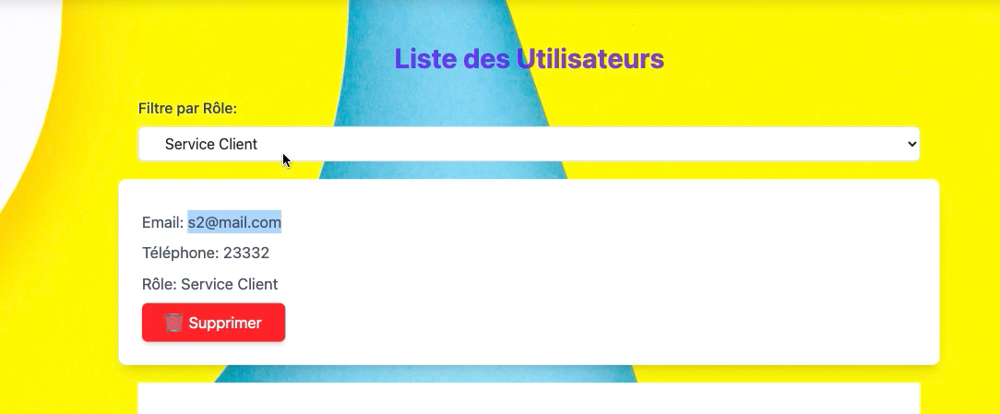 |  | 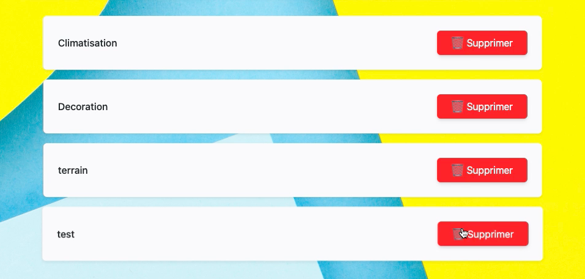 | 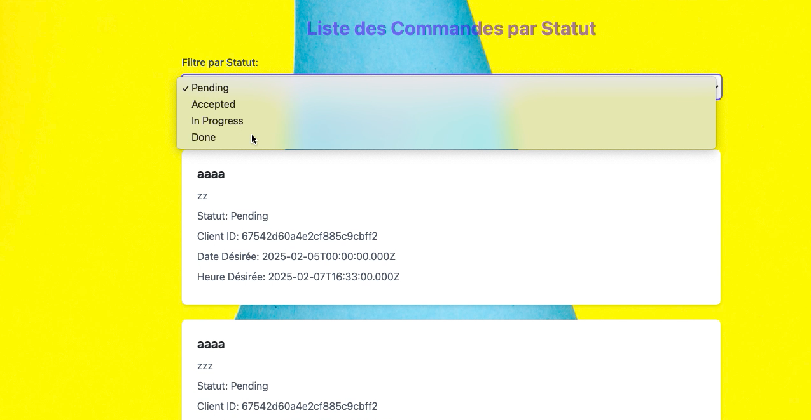 |

---

### 🛠️ Manage Services / Categories  
| Add Service | Filter by Category |
|--------------|--------------------|
| 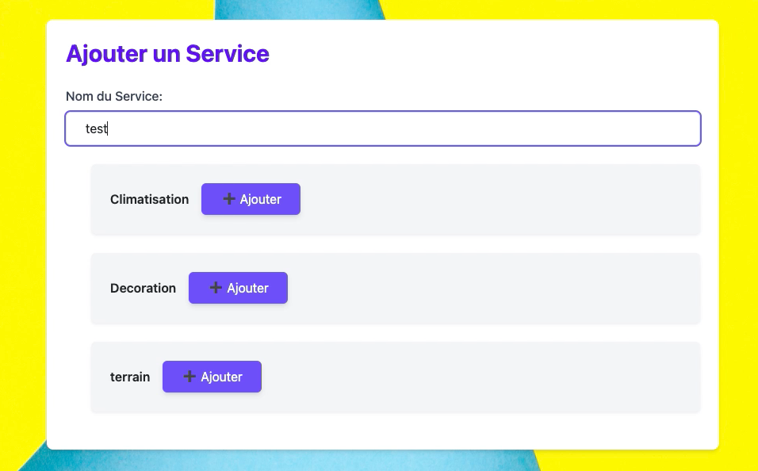 | 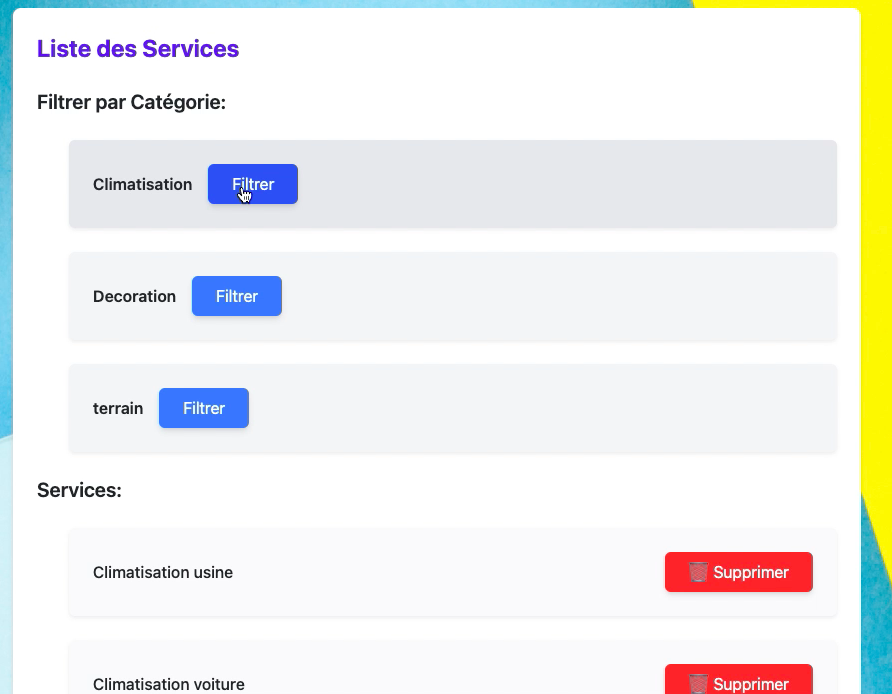 |

---

### 💬 Real-Time Chat System  

---

### 📊 Worker Dashboard  
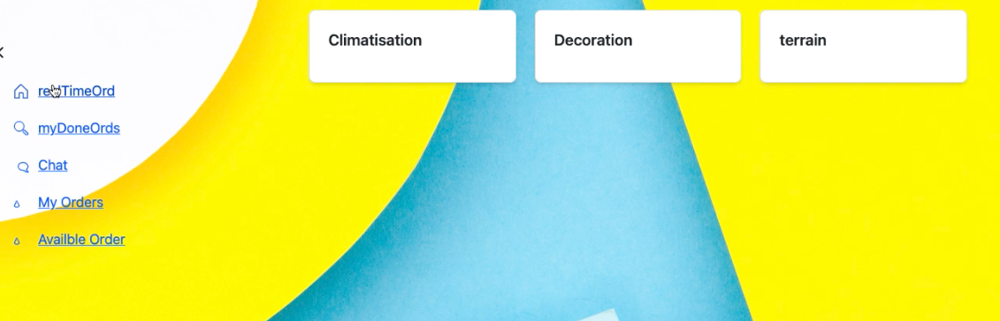

---

## 🧠 Tech Stack

| Layer | Technologies |
|--------|--------------|
| **Frontend** | React.js, Redux Toolkit, Tailwind CSS |
| **Backend** | Node.js, Express.js |
| **Database** | MongoDB + Mongoose |
| **Real-Time** | Socket.IO |
| **Authentication** | JWT + bcrypt |
| **Hosting** | Render (Backend), Netlify/GitHub Pages (Frontend), MongoDB Atlas |

---

  

